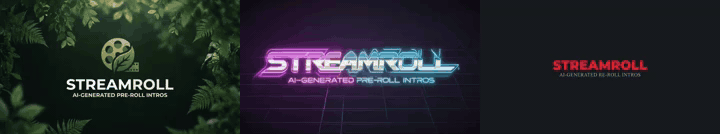

# StreamRoll

**StreamRoll generates custom animated pre-roll intros for home media servers — the same idea as Netflix's "Tudum" logo sting, but for your personal Plex, Jellyfin, or Emby setup.**



A pre-roll is a short video that plays before every movie in your library. Plex, Jellyfin, and Emby all support them natively — most people either skip the feature entirely or spend hours sourcing one. StreamRoll generates one from your service name and a text prompt in about 30 seconds.

Type a name like "Joeflix", pick a visual style, and get a downloadable `.mp4` ready to drop straight into your media server. Built on the [Runway API](https://dev.runwayml.com) as a demonstration of chaining image and video generation.

**[Live demo →](https://streamroll.vercel.app)**

---

## How it works

Two Runway API calls, chained:

1. **Image generation** — a style-tuned text prompt produces a 1920×1080 title card. Model is selected per style: `gen4_image`, `gen4_image_turbo`, `gemini_image3_pro`, or `gpt_image_2`.
2. **Image-to-video** — that still frame animates into a 4–5 second intro. Model options: `gen4_turbo`, `gen4.5` (with timestamp-sequenced prompts), or Veo 3.1 (with generated audio).

The output URL from step 1 is the input to step 2. That's the whole pattern.

```ts
// Step 1: generate the logo
const imageTask = await runway.textToImage.create({
  model: "gen4_image",
  promptText: `Streaming service logo for "JOEFLIX", deep navy and gold,
    dramatic god rays, bold typography, professional logo design`,
  ratio: "1920:1080",
}).waitForTaskOutput();

// Step 2: animate it
const videoTask = await runway.imageToVideo.create({
  model: "gen4.5",
  promptImage: imageTask.output[0],
  promptText: `[00:00] Logo pulses with a slow golden breath. [00:01] Golden
    particles drift upward. [00:02] Lens flare blooms from the right.
    [00:04] Scene settles. Cinematic, dramatic.`,
  ratio: "1280:720",
  duration: 5,
}).waitForTaskOutput();

console.log(videoTask.output[0]); // → your .mp4 URL
```

The `Copy as script` button in the UI outputs this exact code for whatever you just generated.

See the [How it's built](https://streamroll.vercel.app/how-it-works) page for a full walkthrough.

---

## Features

- **In-browser audio mixing** — upload an audio file (MP3, WAV, AAC, OGG, FLAC, M4A) and mix it into your generated video entirely client-side via FFmpeg.wasm; nothing leaves your device. Includes loop and fade-out options with a live 5-step progress UI.
- **9 visual styles** — Prestige, Cinematic, Retro, Futuristic, Minimal, Horror, Anime, Epic, Nature
- **Seasonal presets** — Fall, Winter, Spring, Summer with atmospheric custom notes
- **Holiday presets** — Halloween, Christmas, New Year's Eve, Valentine's Day, St. Patrick's Day, Fourth of July, Thanksgiving, Hanukkah
- **Style auto-selects the best model** — each style maps to the image model, video model, treatment, and duration that produce the best result
- **Logo review step** — approve the generated image before spending video credits
- **Real-time progress bar** — live percentage during video generation, no blind waiting
- **Editable prompts** — see and modify exactly what gets sent to the API before running
- **Redo video** — regenerate the video from the same logo without starting over
- **Upload your own logo** instead of generating one
- **5 image models** — Gen4 Image, Gen4 Turbo, GPT Image 2, Gemini Image 3 Pro, Gemini 2.5 Flash
- **6 video models** — Gen4 Turbo, Gen4.5, Gen3a Turbo, Veo 3, Veo 3.1, Veo 3.1 Fast (with generated audio)
- **Copy as script** — exports the exact Node.js code that produced your video
- **Named downloads** — files save as `joeflix-cinematic-2026-05-11-1430.mp4`
- **One-click share** to r/plexprerolls and X
- **Install instructions** for Plex, Jellyfin, and Emby built in

---

## Deploy to Vercel

The easiest way to run StreamRoll for others to use. Each visitor brings their own Runway API key — no server-side credentials needed.

**1. Install the Vercel CLI**

```bash
npm i -g vercel
```

**2. Deploy**

```bash
vercel
```

The CLI will prompt you to log in and link the project on first run. No environment variables are required — the app is BYOK (users enter their own Runway API key in the browser).

That's it. Vercel's Hobby plan (free) is sufficient for a personal or demo deployment.

---

## Running locally

**1. Clone and install**

```bash
git clone https://github.com/JoeKarlsson/streamroll
cd streamroll
npm install
```

**2. Get a Runway API key**

Sign up at [dev.runwayml.com](https://dev.runwayml.com) — the free tier includes enough credits to generate several videos.

**3. Add your key**

```bash
cp .env.example .env.local
# edit .env.local and set RUNWAYML_API_SECRET=your_key_here
```

Or skip this and enter your key directly in the app at `/setup` — it's stored in your browser only, never sent to a server.

**4. Start the dev server**

```bash
npm run dev
```

Open [http://localhost:3000](http://localhost:3000).

---

## Tech stack

- [Next.js](https://nextjs.org) App Router
- [`@runwayml/sdk`](https://github.com/runwayml/sdk-node) — official Runway Node.js SDK
- [`@ffmpeg/ffmpeg` + `@ffmpeg/core`](https://github.com/ffmpegwasm/ffmpeg.wasm) — in-browser video/audio muxing via WebAssembly; served from the same origin via a classic blob worker for cross-browser compatibility
- [Tailwind CSS](https://tailwindcss.com)
- Deployed on [Vercel](https://vercel.com) — free Hobby tier, no env vars needed

---

## Runway API resources

- [SDK docs](https://docs.dev.runwayml.com/api-details/sdks/)
- [Image-to-video reference](https://docs.dev.runwayml.com)
- [Pricing](https://docs.dev.runwayml.com/guides/pricing/)
- [Developer community on Discord](https://discord.gg/runwayml)

---

Built by [Joe Karlsson](https://joekarlsson.com)
